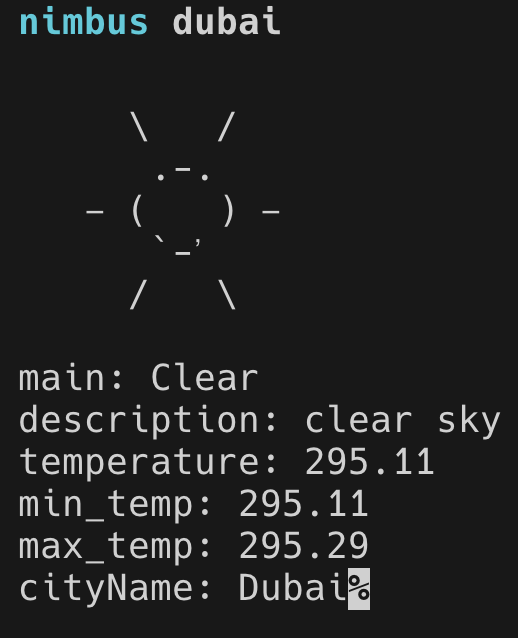

# Nimbus – A Deno-Powered Weather CLI

**Nimbus** is a lightweight command-line tool built with **Deno** that fetches real-time weather data using OpenWeatherMap. It leverages **streams** for efficient data handling, making it fast and resource-friendly.

## Features

- Get real-time weather for any city
- Built with **Deno** – no npm, just run it!
- Uses **streams** for optimized performance
- Displays temperature, humidity, wind speed, and weather condition

## Installation & Setup

### **Prerequisites**

Install **Deno** if you haven’t already:

```sh
curl -fsSL https://deno.land/x/install/install.sh | sh
```

## Clone the repository

Clone this repository and navigate to the project folder:

`git clone https://github.com/your-username/nimbus.git`
`cd nimbus`

## 🌤️ Usage

Run Nimbus without installation
Deno allows you to run scripts directly:

````deno run --allow-net nimbus.ts <city-name>
deno run --allow-net nimbus.ts London```
````

## Set up an OpenWeatherMap API key

- Get an API key from OpenWeatherMap.
- Export it as an environment variable (Deno uses Deno.env for env management):
- export API_KEY="your_api_key_here"
- Alternatively, you can store it in a .env file and use deno run --allow-env.

## Sample Output



## Technologies Used

- Deno – Secure & modern runtime for JavaScript/TypeScript
- Fetch API – Native in Deno, no external dependencies
- Streams – Efficient data handling
- OpenWeatherMap API – Real-time weather data

## 🌍 System-Wide Installation (Optional)

Want to run `nimbus` from anywhere in your terminal? Follow these steps:

### 1️⃣ **Add API Key to Your Shell Profile**

Edit your `~/.zshrc` (or `~/.bashrc` for Bash users):

```sh
nano ~/.zshrc
```

Then, add this line at the end:

```

export API_KEY="your_api_key_here"
```

Save and apply the changes:

```

source ~/.zshrc

```

## 2️⃣ Create an Alias for Easy Use

Still inside ~/.zshrc, add:

```
alias nimbus='deno run --allow-net --allow-env /path/to/nimbus.ts'`
```

(Replace /path/to/nimbus.ts with the actual file path.)

## 3️⃣ Restart Your Terminal & Run Nimbus Anywhere!

Now, you can run:

```

nimbus London

```

from any directory in your system. ✅

## Uninstalling Nimbus (Remove Global Alias & API Key)

To remove the alias and API key, open ~/.zshrc and delete the lines you added, then run:

```
source ~/.zshrc
```
